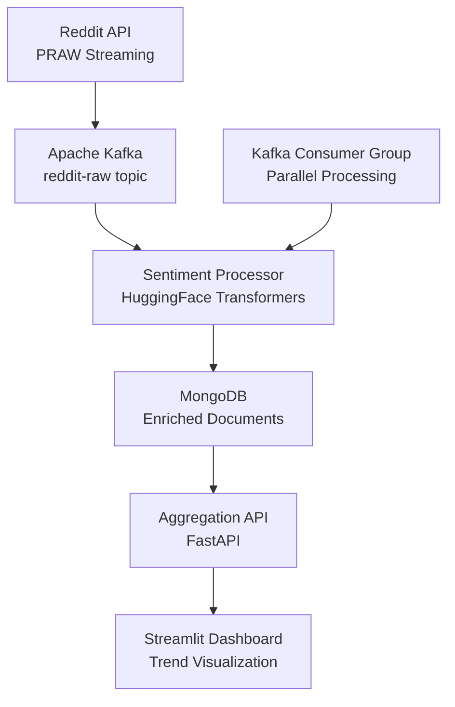

# Reddit Sentiment Analysis — Kafka + MongoDB + NLP


Real-time Reddit post and comment streaming pipeline with NLP-based sentiment classification. Ingests live Reddit data via PRAW, streams through Kafka, enriches with transformer-based sentiment scores, and stores enriched documents in MongoDB for trend analysis.

## Architecture



## Features

- Live Reddit streaming with PRAW (pushshift-compatible)
- Kafka consumer groups for parallel NLP processing
- HuggingFace `cardiffnlp/twitter-roberta-base-sentiment` model
- MongoDB Atlas / local with time-series collection support
- Topic and subreddit trend detection with sliding windows
- FastAPI backend + Streamlit dashboard for exploration

## Tech Stack

| Layer | Technology |
|-------|-----------|
| Data Source | Reddit API (PRAW) |
| Message Bus | Apache Kafka |
| NLP Model | HuggingFace Transformers (RoBERTa) |
| Storage | MongoDB (time-series collections) |
| API | FastAPI |
| Visualization | Streamlit |

## Prerequisites

- Docker & Docker Compose
- Python 3.10+
- Reddit API credentials (client_id, client_secret)

## Quick Start

```bash
git clone https://github.com/zulham-tech/reddit-sentiment-kafka-mongodb-nlp.git
cd reddit-sentiment-kafka-mongodb-nlp
cp .env.example .env  # add Reddit API credentials
docker compose up -d
python producers/reddit_stream.py --subreddit technology
```

## Project Structure

```
.
├── producers/           # Reddit PRAW streaming producers
├── consumers/           # Kafka consumers with NLP pipeline
├── models/              # Sentiment model wrapper & caching
├── api/                 # FastAPI trend endpoints
├── dashboard/           # Streamlit visualization app
├── mongodb/             # Index definitions & aggregations
├── docker-compose.yml
└── requirements.txt
```

## Author

**Ahmad Zulham** — [LinkedIn](https://linkedin.com/in/ahmad-zulham-665170279) | [GitHub](https://github.com/zulham-tech)
